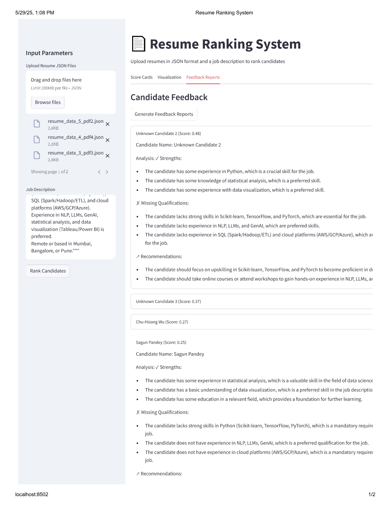

# 🤖 AI-Powered Resume Feedback & Skill Gap Analysis System

An intelligent, interactive system that analyzes resumes in relation to job descriptions (JDs), identifies skill gaps, and generates personalized feedback to guide both candidates and recruiters.

---


## 🚀 What It Does

- 📥 Takes **multiple resumes and a job description** as input  
- 🧠 Performs **skill gap analysis** based on the provided inputs  
- 📊 Outputs include:
  1. **Individual scorecards** for each candidate  
  2. **Comparative bar chart** visualizing skill alignment across all candidates  
  3. **LLM-generated feedback**, highlighting:  
     - Top 3 strengths  
     - 3 skill gaps  
     - 2 personalized upskilling suggestions  


---

## 🛠️ Tech Stack

| Layer             | Technology                             |
|------------------|-----------------------------------------|
| Frontend          | Streamlit                              |
| Backend Logic     | Python                                 |
| Embeddings Model  | SentenceTransformers (`MiniLM-L12-v2`) |
| Feedback Engine   | Groq API with LLaMA 3-70B              |
| Visualization     | Matplotlib, NumPy                      |
| Config Management | `dotenv` for API key security          |

---
## Inputs:
### 📄1.Multiple Resumes (JSON)
### Ex: Resume Format
```json
{
  "Name": "Jane Doe",
  "Skills": ["Python", "SQL", "AWS"],
  "Experience": {
    "Company": "TechCorp",
    "Role": "Data Engineer",
    "Duration": "3 years"
  },
  "Education": {
    "Degree": "B.Tech",
    "Field": "Computer Science"
  }
}
```
## 📄2.Job Description(string)
### EX: Job Description Format
```
job_description = """Looking for candidate with 3+ years of experience.  
Must have strong skills in Python (Scikit-learn, TensorFlow, PyTorch), SQL (Spark/Hadoop/ETL), and cloud platforms (AWS/GCP/Azure).  
Experience in NLP, LLMs, GenAI, statistical analysis, and data visualization (Tableau/Power BI) is preferred.  
Remote or based in Mumbai, Bangalore, or Pune."""
```

## 📦 Output

The system produces the following outputs for each batch of resumes:

1. 📄 **Scorecards**  
   Individual scorecards showing per-candidate breakdown across skill, experience, education, and keyword match.  
   

2. 📊 **Visualization**  
   Comparative bar chart visualizing how all candidates score across evaluation metrics.  
   

3. 💬 **LLM-Generated Feedback**  
   Structured feedback per candidate, highlighting:  
   - Top 3 strengths  
   - 3 skill gaps  
   - 2 personalized upskilling suggestions  
   
