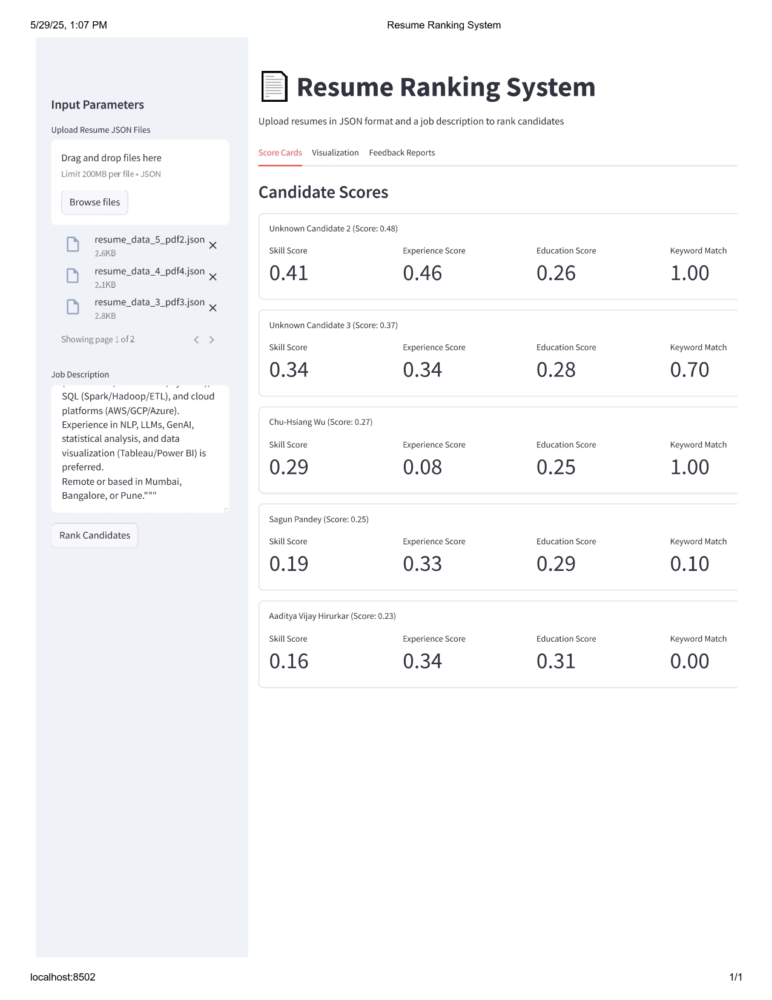
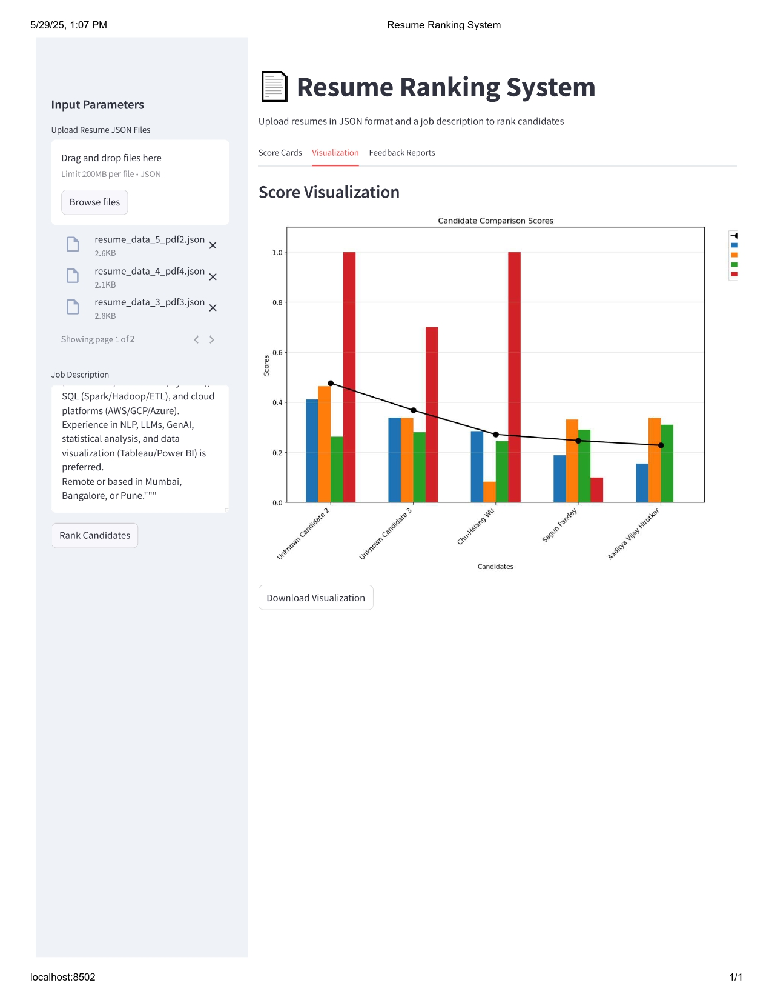

# 🤖 AI-Powered Resume Feedback & Skill Gap Analysis System

[](https://www.python.org/)
[](./LICENSE)
[](#)


An intelligent, interactive system that analyzes resumes in relation to job descriptions (JDs), identifies skill gaps, and generates personalized feedback to guide both candidates and recruiters.

---


## 🚀 Features

- 📥 Takes **multiple resumes and a job description** as input  
- 🧠 Performs **skill gap analysis** based on the provided inputs  
- 📊 Outputs include:
  1. **Individual scorecards** for each candidate  
  2. **Comparative bar chart** visualizing skill alignment across all candidates  
  3. **LLM-generated feedback**, highlighting:  
     - Top 3 strengths  
     - 3 skill gaps  
     - 2 personalized upskilling suggestions  


---

## 🛠️ Tech Stack

| Layer             | Technology                                |
|------------------|--------------------------------------------|
| Frontend          | Streamlit                                 |
| Backend Logic     | Python                                    |
| Embeddings Model  |SentenceTransformers (`all-MiniLM-L12-v2`) |
| Feedback Engine   | Groq API with LLaMA 3-70B                 |
| Visualization     | Matplotlib, NumPy                         |
| Config Management | `dotenv` for API key security             |

---
## Inputs:
### 📄1.Multiple Resumes (JSON)
### Ex: Resume Format
```json
{
  "Name": "Jane Doe",
  "Skills": ["Python", "SQL", "AWS"],
  "Experience": {
    "Company": "TechCorp",
    "Role": "Data Engineer",
    "Duration": "3 years"
  },
  "Education": {
    "Degree": "B.Tech",
    "Field": "Computer Science"
  }
}
```
## 📄 2. Job Description (String)
### 🧾 Example Format:

```
job_description = """Looking for candidate with 3+ years of experience.  
Must have strong skills in Python (Scikit-learn, TensorFlow, PyTorch), SQL (Spark/Hadoop/ETL), and cloud platforms (AWS/GCP/Azure).  
Experience in NLP, LLMs, GenAI, statistical analysis, and data visualization (Tableau/Power BI) is preferred.  
Remote or based in Mumbai, Bangalore, or Pune."""
```

## 📦 Outputs:

The system produces the following outputs for each batch of resumes:

1. 📄 **Scorecards**  
   Individual scorecards showing per-candidate breakdown across skill, experience, education, and keyword match.  
   

2. 📊 **Visualization**  
   Comparative bar chart visualizing how all candidates score across evaluation metrics.  
   

3. 💬 **LLM-Generated Feedback**  
   Structured feedback per candidate, highlighting:  
   - Top 3 strengths  
   - 3 skill gaps  
   - 2 personalized upskilling suggestions  
   
## ⚙️ How It Works

This application performs intelligent resume analysis and ranking through the following steps:

1. 📥 **Input via Streamlit UI**
   - Upload multiple resumes in `.json` format.
   - Paste the job description into a text area.

2. 🧠 **Skill Gap Analysis**
   - Uses custom Python logic and a sentence-transformer model to:
     - Extract skills, experience, and education.
     - Compare them against the job description using semantic similarity and keyword matching.

3. 🤖 **LLM-Based Feedback**
   - Passes each candidate's scores and profile through a large language model (LLM) via the **Groq API**.
   - Generates structured, detailed feedback per candidate:
     - ✅ Strengths
     - ❌ Gaps
     - 📈 Upskilling recommendations

4. 📊 **Output Display**
   - Shows:
     - Individual **Scorecards**
     - Comparative **Visualizations**
     - LLM-generated **Feedback Reports**

Everything runs in-browser through a clean, responsive **Streamlit interface**.


## 📦 Installation

### 1. Clone the repo

```bash
git clone https://github.com/your-username/ai-resume-feedback.git
cd ai-resume-feedback
```

### 2. Install dependencies

```bash
pip install -r requirements.txt
```

### 3. Set your API Key

Create a `.env` file with your Groq API key:

```ini
GROQ_API_KEY=your_groq_api_key_here
```

### 4. Run the app

```bash
streamlit run app.py
```
### 📄 requirements.txt

```txt
sentence-transformers
groq
langchain-community
python-dotenv
streamlit
```

## 👤 Author

**Bharath Kumar**  
GitHub: [@Bharathkumar1011](https://github.com/Bharathkumar1011)

## 📜 License

MIT License
